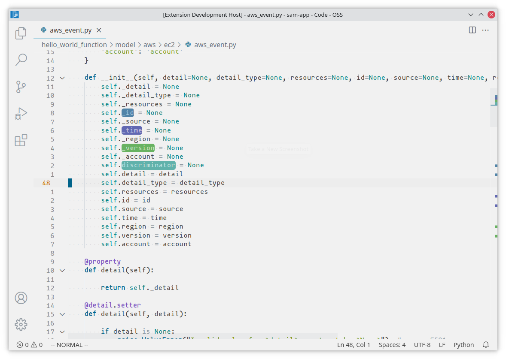

<div align="center">

# Crayons

Highlight text with crayons - A powerful VS Code extension for text highlighting



</div>

## Features

### 🎨 Smart Text Highlighting
- **Selected Text Priority**: If you have text selected, it will highlight the selection
- **Word Detection**: If no text is selected, it highlights the word at cursor position
- **Multiple Colors**: Automatically cycles through different colors for different highlighted terms
- **Persistent Highlights**: Highlights are preserved when switching between files

### ⌨️ Manual Text Input
- **Custom Highlighting**: Manually input any text string to highlight
- **Regular Expression Support**: Use regex patterns for advanced text matching
- **Flexible Search**: Highlight terms that may not be easily selectable
- **Toggle Highlighting**: Re-highlighting the same term removes the highlight

### 🔧 Management Commands
- **Clear Individual**: Remove specific highlights
- **Clear All**: Remove all highlights from current file
- **Cross-file Support**: Each file maintains its own highlight state

## Commands

| Command | Description | Default Keybinding |
|---------|-------------|-------------------|
| `Crayons: Highlight` | Highlight selected text or word at cursor | `; k` |
| `Crayons: Highlight Manual Input` | Open input box to manually enter text to highlight | `Ctrl+Shift+F2` |
| `Crayons: Clear` | Clear highlights for current selection/word | `Ctrl+Shift+F1` |
| `Crayons: Clear All Highlights` | Clear all highlights in current file | - |

## Usage

### Quick Highlighting
1. **Select text** and press `; k` to highlight the selection
2. **Place cursor** on a word and press `; k` to highlight that word
3. Press the same shortcut on highlighted text to **remove the highlight**

### Manual Input Highlighting
1. Press `Ctrl+Shift+F2` to open the input dialog
2. Type the text you want to highlight (supports both plain text and regex)
3. Choose between "普通文本" (plain text) or "正则表达式" (regular expression) mode
4. Press Enter to apply the highlight

#### Regular Expression Examples
- **Email addresses**: `\b\w+@\w+\.\w+\b`
- **URLs**: `https?://[^\s]+`
- **Numbers**: `\b\d+\b`
- **Words starting with capital**: `\b[A-Z]\w*\b`
- **Function calls**: `\w+\s*\(`

### Managing Highlights
- Use `Ctrl+Shift+F1` to clear highlights for the current selection/word
- Use the Command Palette (`Ctrl+Shift+P`) and search for "Crayons: Clear All Highlights" to remove all highlights

## Configuration

### Color Customization

You can customize the highlighting colors in your VS Code settings:

```json
{
  "crayons.configuration.colors": [
    {
      "light": {
        "bg": "#5184a8",
        "fg": "#b7ccdc"
      },
      "dark": {
        "bg": "#c7d8e4", 
        "fg": "#ffffff"
      }
    },
    {
      "light": {
        "bg": "#6168b2",
        "fg": "#c7cae4"
      },
      "dark": {
        "bg": "#c7cae4",
        "fg": "#ffffff"
      }
    },
    {
      "light": {
        "bg": "#68b261",
        "fg": "#cae4c7"
      },
      "dark": {
        "bg": "#cae4c7",
        "fg": "#ffffff"
      }
    },
    {
      "light": {
        "bg": "#61b2ab",
        "fg": "#c7e4e1"
      },
      "dark": {
        "bg": "#61b2ab",
        "fg": "#c7e4e1"
      }
    }
  ]
}
```

### Color Properties
- `bg`: Background color for the highlight
- `fg`: Foreground (text) color
- `light`: Colors used in light theme
- `dark`: Colors used in dark theme

The extension automatically cycles through the defined colors when highlighting different terms.

## Installation

### From VS Code Marketplace
1. Open VS Code
2. Go to Extensions (`Ctrl+Shift+X`)
3. Search for "crayons"
4. Click Install

### From GitHub Release
1. Download the latest `.vsix` file from [GitHub Releases](https://github.com/FireKingY/crayons/releases)
2. Open VS Code
3. Press `Ctrl+Shift+P` and run "Extensions: Install from VSIX..."
4. Select the downloaded `.vsix` file

## Release Notes

### v0.3.0
- ✨ **Regular Expression Support**: Added regex pattern matching in manual input mode
- ✨ **Smart Input Dialog**: Interactive choice between plain text and regex modes
- 🛡️ **Error Handling**: Regex syntax validation with helpful error messages
- 🔧 **Enhanced Matching**: Improved text matching logic with proper escaping

### v0.2.0
- ✨ Enhanced highlighting logic: prioritize selected text over word detection
- ✨ Added manual text input command with `Ctrl+Shift+F2` shortcut
- 🐛 Improved highlighting behavior for better user experience
- 📖 Updated documentation and README

### v0.1.1
- Initial release
- Basic text highlighting functionality
- Multiple color support
- Clear commands

## Contributing

Issues and pull requests are welcome! Please visit our [GitHub repository](https://github.com/FireKingY/crayons).

## License

See [LICENSE](LICENSE)

---

**Enjoy highlighting! 🎨**

